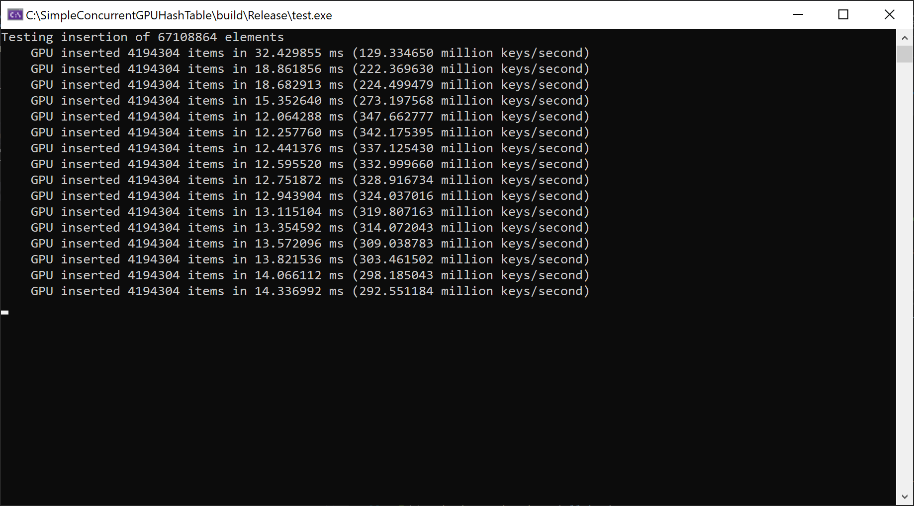

# About

This project shows how to implement a simple GPU hash table. Thanks to the high bandwidth and massive parallelism of
GPU's, the result is a high performance hash table capable of hundreds of millions of operations per second.

The code achieves an average insertion rate of 326 million key/second on my development laptop with an NVIDIA GTX 1060,
measured by inserting 64 million elements.

[Read my blog post about the code here](http://nosferalatu.com/SimpleGPUHashTable.html) for more information about the
implementation.

The code implements a lock free hash table using linear probing. Concurrent inserts, deletes, and lookups are supported by
this hash table. The hash table works on 32 bit keys and 32 bit values (although 0xffffffff is reserved for both keys
and values). The load factor of the table is set to 50% in the code, and the table size must be a power of two.

Atomic operations are used to insert key/value pairs into the hash table on multiple GPU threads. It uses CUDA for ease
of development, but could easily be ported to HLSL or GLSL. 64 bit keys and/or values could be supported using 64 bit
atomics.

Resizing the hash table is not implemented (it's a *simple* hash table!) although this can be achieved by inserting the
contents of a table into another, larger table.

The code was kept simple for readability. There are many optimizations that can be done, but they muddy the waters. I
wanted to illustrate the basic design of the lock free hash table and how it can be implemented on a GPU.

# How To Use

If you build and run the executable, it enters an infinite loop of inserting and deleting random numbers into the
GPU hash table and verifying that the results are correct. The seed used to generate random numbers changes every time
you run the executable, but you can set the seed to a specific value in code if you'd like to reproduce results across
runs.

This is how you insert a vector of `KeyValue` pairs into the hash table and then retrieve all the `KeyValue` pairs back:

```cpp
    std::vector<KeyValue> things_to_insert = { {0,1}, {1,2}, {2,3}, {3,4} };

    KeyValue* pHashTable = create_hashtable();
    insert_hashtable(pHashTable, things_to_insert.data(), (uint32_t)things_to_insert.size());
    std::vector<KeyValue> result = iterate_hashtable(pHashTable);
    destroy_hashtable(pHashTable);
```

After that runs, the vectors `things_to_insert` and `result` should be the same, but possibly in a different order.

# Prerequisites

* CMake
* CUDA

This has been tested on Windows with Visual Studio Community 2019 on a machine with an NVIDIA GTX 1060.
An easy way to get CMake is to open a Visual Studio command prompt (in Windows, run "x64 Native Tools Command Prompt for
VS 2019"; that will put CMake in your path).

This should work on other CUDA-supported platforms, but I have not tested this.

# Cloning

```
git clone https://github.com/nosferalatu/SimpleConcurrentGPUHashTable.git SimpleConcurrentGPUHashTable
```

# Generating Build Files

Run the following commands to generate .sln and .vcxproj's that can be opened in Visual Studio:

```
cd ConcurrentHashTables
md build
cd build
cmake ..
```

You can now open `SimpleConcurrentGPUHashTable.sln` in Visual Studio.

If CMake fails to find CUDA above, then run a CMake generator for 64 bit builds:
```
cmake -G "Visual Studio 16 2019 Win64" ..
```

# Building

You can build within Visual Studio, or from the command line with:

```
cmake --build . --config Release
```
